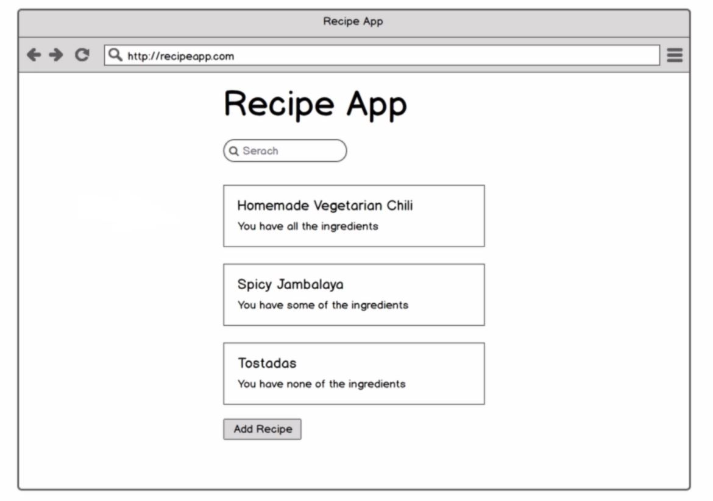
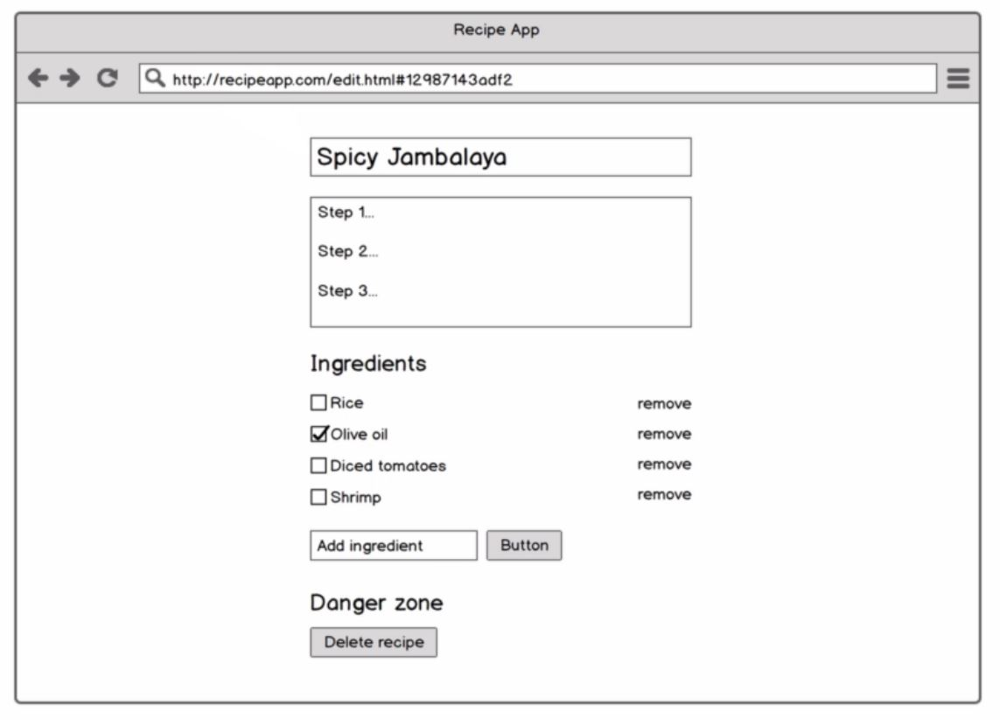

# Recipe App

[View the live app here](https://mikebroome-recipe-app.netlify.com)

Recipe management app for adding and tracking recipes, using modern JavaScript.

This project is a follow up challenge apon completion of [The Modern JavaScript Bootcamp by Andrew Mead.](https://www.udemy.com/course/modern-javascript/)

### Challenge guidelines:

